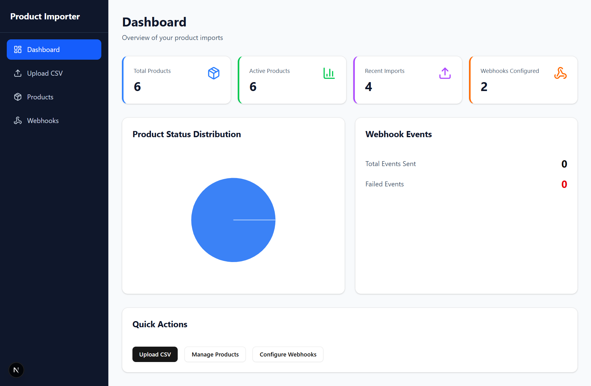
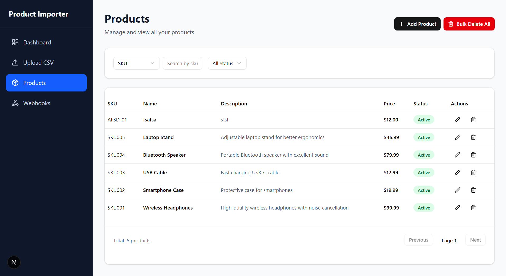
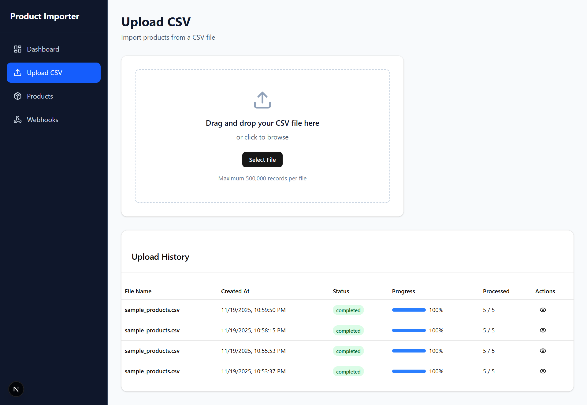
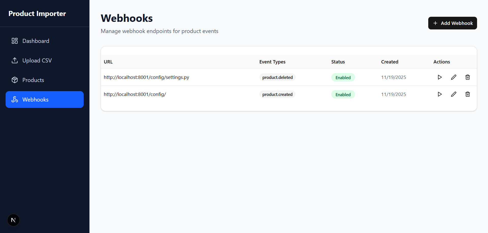

# BulkFlow - Product Management System

A comprehensive full-stack application for managing products with bulk CSV import capabilities, real-time analytics, and webhook integrations.

## 🚀 Features

- **Product Management**: Complete CRUD operations with advanced filtering and search
- **Bulk CSV Import**: Asynchronous file processing with real-time progress tracking
- **Analytics Dashboard**: Interactive charts and real-time statistics
- **Webhook System**: Configurable webhooks for product events
- **Modern UI**: Responsive design with dark/light theme support
- **Real-time Updates**: Live progress tracking and notifications

## 📸 Screenshots

*Add your screenshots here after creating the README*






## 🎯 User Flow

### 1. Dashboard Overview
- View key metrics: total products, active products, recent imports, configured webhooks
- Interactive charts showing product status distribution
- Quick action buttons for common tasks

### 2. Product Management
- **List View**: Browse all products with pagination and filtering
- **Kanban View**: Visual board showing products by status
- **Search & Filter**: Find products by SKU, name, or status
- **CRUD Operations**: Create, edit, and delete products
- **Bulk Actions**: Delete all products at once

### 3. CSV Upload Process
- **File Selection**: Choose CSV file with product data
- **Upload Progress**: Real-time progress bar and status updates
- **Job Tracking**: Monitor import status with detailed statistics
- **Error Handling**: View failed imports with detailed error messages

### 4. Webhook Management
- **Configuration**: Set up webhooks for product events
- **Event Types**: Choose from product.created, product.updated, product.deleted
- **Testing**: Test webhook endpoints before activation
- **Monitoring**: Track webhook delivery success/failure rates

## 🛠️ Tech Stack

### Frontend
- **Next.js 16** - React framework with App Router
- **React 19** - Latest React with concurrent features
- **TypeScript** - Type-safe development
- **Tailwind CSS** - Utility-first CSS framework
- **Shadcn/ui** - Modern UI component library
- **React Query** - Data fetching and caching
- **Recharts** - Data visualization
- **Axios** - HTTP client
- **Zod** - Schema validation

### Backend
- **Django 5.0+** - Python web framework
- **Django REST Framework** - API development
- **PostgreSQL** - Primary database
- **Celery + Redis** - Asynchronous task processing
- **Python 3.11+** - Programming language

## 📋 Prerequisites

Before running this application, make sure you have:

- **Node.js 18+** and npm/yarn
- **Python 3.11+**
- **PostgreSQL 12+**
- **Redis 6+**

## 🚀 Quick Start

### 1. Clone the Repository

```bash
git clone <repository-url>
cd BulkFlow
```

### 2. Backend Setup

```bash
cd Backend

# Create virtual environment
python -m venv venv
source venv/bin/activate  # On Windows: venv\Scripts\activate

# Install dependencies
pip install -r requirements.txt

# Environment setup
cp .env.example .env
# Edit .env with your database and Redis settings

# Database setup
createdb product_importer  # Create PostgreSQL database
python manage.py makemigrations
python manage.py migrate
python manage.py createsuperuser

# Start Redis (in separate terminal)
redis-server

# Start Celery worker (in separate terminal)
celery -A config worker --loglevel=info

# Start Django server
python manage.py runserver
```

### 3. Frontend Setup

```bash
cd Frontend

# Install dependencies
npm install
# or
yarn install

# Environment setup
cp .env.example .env.local
# Edit .env.local with your backend API URL

# Start development server
npm run dev
# or
yarn dev
```

### 4. Access the Application

- **Frontend**: http://localhost:3000
- **Backend API**: http://localhost:8000/api
- **Django Admin**: http://localhost:8000/admin
- **API Documentation**: http://localhost:8000/api/docs

## 📁 Project Structure

```
BulkFlow/
├── Backend/                    # Django REST API
│   ├── config/                # Django configuration
│   │   ├── settings.py        # Main settings
│   │   ├── urls.py           # URL routing
│   │   ├── celery.py         # Celery configuration
│   │   └── wsgi.py           # WSGI application
│   ├── core/                  # Base models and utilities
│   │   ├── models.py         # Abstract base models
│   │   └── views.py          # Dashboard endpoints
│   ├── product/               # Product management module
│   │   ├── models/           # Product models
│   │   ├── serializers.py    # API serializers
│   │   ├── views.py          # API views
│   │   └── urls.py           # URL patterns
│   ├── import_manager/        # CSV import module
│   │   ├── models/           # Import job models
│   │   ├── services/         # Import logic
│   │   ├── tasks.py          # Celery tasks
│   │   └── views.py          # Import endpoints
│   ├── webhook/               # Webhook module
│   │   ├── models/           # Webhook models
│   │   ├── services/         # Webhook execution
│   │   ├── tasks.py          # Async webhook tasks
│   │   └── views.py          # Webhook endpoints
│   ├── requirements.txt       # Python dependencies
│   └── manage.py             # Django management
│
├── Frontend/                  # Next.js application
│   ├── app/                  # App Router pages
│   │   ├── layout.tsx        # Root layout
│   │   ├── page.tsx          # Dashboard page
│   │   ├── products/         # Product management
│   │   ├── upload/           # CSV upload
│   │   └── webhooks/         # Webhook management
│   ├── components/           # React components
│   │   ├── ui/              # Shadcn/ui components
│   │   ├── sidebar.tsx      # Navigation
│   │   └── modals/          # Modal components
│   ├── lib/                 # Utilities and API
│   │   ├── api.ts           # API client
│   │   ├── types.ts         # TypeScript types
│   │   └── validations.ts   # Zod schemas
│   ├── package.json         # Node dependencies
│   └── next.config.ts       # Next.js configuration
│
└── README.md                 # This file
```

## 🔧 Configuration

### Backend Environment Variables (.env)

```env
# Django Settings
DEBUG=True
SECRET_KEY=your-secret-key-here
ALLOWED_HOSTS=localhost,127.0.0.1

# Database
DB_NAME=product_importer
DB_USER=postgres
DB_PASSWORD=postgres
DB_HOST=localhost
DB_PORT=5432

# Redis
REDIS_URL=redis://localhost:6379/0

# CORS
CORS_ALLOWED_ORIGINS=http://localhost:3000
```

### Frontend Environment Variables (.env.local)

```env
NEXT_PUBLIC_API_URL=http://localhost:8000
```

## 📊 API Endpoints

### Products
- `GET /api/products/` - List products with pagination and filtering
- `POST /api/products/` - Create new product
- `GET /api/products/{id}/` - Get specific product
- `PUT /api/products/{id}/` - Update product
- `DELETE /api/products/{id}/` - Delete product
- `DELETE /api/products/bulk-delete/` - Delete all products

### File Upload
- `POST /api/upload/` - Upload CSV file for bulk import
- `GET /api/jobs/{job_id}/` - Get import job status

### Webhooks
- `GET /api/webhooks/` - List webhooks
- `POST /api/webhooks/` - Create webhook
- `PUT /api/webhooks/{id}/` - Update webhook
- `DELETE /api/webhooks/{id}/` - Delete webhook
- `POST /api/webhooks/{id}/test/` - Test webhook

### Dashboard
- `GET /api/dashboard/stats/` - Get dashboard statistics

## 📝 CSV Format

When uploading products via CSV, use this format:

```csv
sku,name,description,price,image_url,is_active
SKU001,Product 1,Description 1,29.99,https://example.com/img1.jpg,true
SKU002,Product 2,Description 2,49.99,https://example.com/img2.jpg,false
```

**Required Fields:**
- `sku` - Unique product identifier
- `name` - Product name
- `price` - Product price (decimal)

**Optional Fields:**
- `description` - Product description
- `image_url` - Product image URL
- `is_active` - Active status (true/false, default: true)

## 🔗 Webhook Events

Configure webhooks to receive notifications for:

- `product.created` - New product created
- `product.updated` - Product updated
- `product.deleted` - Product deleted
- `import.started` - Bulk import started
- `import.completed` - Bulk import completed
- `import.failed` - Bulk import failed

**Webhook Payload Example:**
```json
{
  "event_type": "product.created",
  "timestamp": "2025-01-15T10:30:00Z",
  "data": {
    "id": 1,
    "sku": "SKU001",
    "name": "Product Name",
    "description": "Product description",
    "price": 29.99,
    "image_url": "https://example.com/image.jpg",
    "is_active": true
  }
}
```

## 🔄 Changelog

### v1.0.0 (Current)
- Initial release
- Product CRUD operations
- CSV bulk import
- Webhook system
- Analytics dashboard
- Real-time progress tracking

---

**Built with ❤️ using Django, Next.js, and modern web technologies**